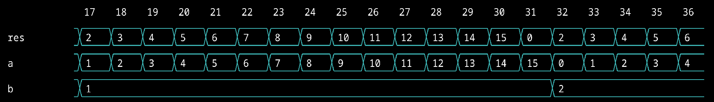

---
geometry:
- top=25mm
- left=25mm
- right=25mm
- heightrounded
...

## Introduction

I am L Lakshmanan, and I have worked on the proposal I put forward to the FOSSi Foundation regarding `Sootty`, the terminal-based graphical waveform viewer, over the past three months under the Google Summer of Code program. 

`Sootty` is a terminal-based graphical waveform viewer that reads a Value Change Dump (VCD) file and generates an SVG file that can be saved or displayed in the terminal. The main use of this software is for hardware designers for testing and verification purposes. It relies on pyvcd to read and parse the VCD files and lark to construct a temporal logic language that can be used to define start points, end points, breakpoints, etc and to manipulate our viewing window. The language has been constructed using a context free grammar that has been defined in lark.

My project proposal was titled "Improving Query Language Features in `Sootty`", and the main goal of the project was to add features and upgrade existing functionality in the temporal logic language that `Sootty` uses. The main milestones, features in this case, implemented are the following:

- Implementation of bitwise operators for multi-wire busses
- Addition of a save flag to allow for a more reusable query interface
- Support for ready-valid handshake detection in the query language according to the AXI protocol, along with a function call framework

## Contribution

The main classes I had to work with are the `ValueChange` and `WireTrace` classes, while also making changes to the grammar file. I also had to add a flag for the save functionality, which was in the main interface and the code for the save functionality has been written from scratch.

### Implementation of bitwise operators for multi-wire busses

The relevant PRs are given below.

- [[Merged] Added modules for bitwise AND, OR and NOT operators](https://github.com/Ben1152000/sootty/pull/38)
- [[Closed] Bitwise operator implementation, requires bug fixes](https://github.com/Ben1152000/sootty/pull/36)

This PR includes the modifications required to include the bitwise operator functionality in the query language. To do this the standard logical operator symbols have been repurposed and reassigned to different symbols. The operators right now include

- AND - `&`
- OR - `|`
- LAND - `&&`
- LOR - `||`
- INV - `~`
- NOT - `!`

The logical operators are lower in precedence as compared to the bitwise operators. This required the grammar of the language to be tweaked in the lark file and methods to be added to the ValueChange class as well to achieve the functionality we desired. The operators are now fully integrated with the language and can be used with queries. The inclusion of this feature was mainly because the temporal logic language that `Sootty` uses did not have a simple straight forward way to run bitwise operations and this is an essential feature in a circuit debugging software. Hence, this implementation fixes this issue.
 
### Addition of a save flag to allow for a more reusable query interface

The relevant PRs are given below.

- [[Merged] Added modules for save functionality](https://github.com/Ben1152000/sootty/pull/43)
- [[Merged] Improvement to save functionality, YAML savefile implementation](https://github.com/Ben1152000/sootty/pull/51)
- [[Merged] Fixed bug in new number system, global reload bug fix](https://github.com/Ben1152000/sootty/pull/54)

The purpose of the save flag was to allow users to save queries that they might want to reuse on a regular basis to allow for quick testing and reloading. The `save.py` file has been written from scratch and includes all the required functions for the save fucntionality. The main functionality is as follows. The user enters a query, along with the flag and the name they want to use to refer to the query, i.e. `sootty <flags> -S <query name>`. The query is then saved in a YAML file called `queries.yaml` in the user's `~/.config/sootty/` folder. This file is where all the queries will be saved in a user-readable format (a nested YAML dictionary). To reload, the user simply has to enter `sootty -R <query name>` and the query they request will be reloaded.

The savefile contains all the details regarding the query, and the saved queries can be reloaded from any directory in the system, regardless of the directory where it is first run and saved. Partial reloading of queries have also been implemented (only a select few flags can be chosen in the reloaded query for usage), and the time when the query is saved is stored in the UNIX timestamp format. 

Once a certain threshold (500 queries) is reached, the oldest queries are deleted to accommodate the new queries. If a query name is reused, the old query is overwritten and the timestamp is changed, essentially registering it as a new query and deleting the old version of the query to prevent conflict. In summary, the following things have been implemented:

- Save functionality to allow for reloading and having queries on the user's system in a readable format
- Partial reloading of queries
- Automatic deletion of queries beyond a certain limit
- Global reload functionality
- Saved query overwrite functionality

The final format of the saved query in `queries.yaml` is as follows.

Input query is

```
sootty example/CLA.vcd -w "a, b, res" -s "AXI(a, b)" -l 20 -S AdderTest
```

The saved data is 

```yaml
AdderTest:
  date: 1664047467126
  query:
    breakpoints: null
    btable: false
    end: null
    filename: /home/karthik/sootty/example/CLA.vcd
    length: 20
    output: false
    radix: 10
    reload: null
    save: AdderTest
    start: AXI(a, b)
    wires: a, b, Res
```

The output of this query is as follows.



### Support for ready-valid handshake detection in the query language according to the AXI protocol

The relevant PRs are given below.

- [[Open, not merged at time of submission] AXI ready-valid handshake detection implementation along with function call implementation](https://github.com/Ben1152000/sootty/pull/68)
- [[Merged] Function call syntax, bug fix](https://github.com/Ben1152000/sootty/pull/66)
- [[Closed] Rudimentary ready-valid handshake detection](https://github.com/Ben1152000/sootty/pull/45)

The ready-valid detection is implemented mainly in the WireTrace class, and changes had to be made to the syntax of the query language to accommodate the desired function call syntax. The implemented version right now allows for extensibility in the sense that we can add multiple functions simply by adding the required functionality in the WireTrace class. The call is also a part of the grammar now.

The function can be called by using `axi(<ready wire>, <valid wire>)` as a condition along with the `-s`, `-e` or `-b` flags just like any other part of the query language to allow us to detect the ready-valid handshake.

For example, if the query we input is of the form

```
sootty example/CLA.vcd -w "a, b, AXI(a, b)" -l 20 -S AXItest
```

We get the following output. The AXI transaction is detected by the line marked `(a & b)`. This is because the AXI implementation right now is implemented at its core with an AND operator, and this implementation can be made more elaborate later.


The AXI transaction detection functionality is mainly to allow users to easily use the condition for the start or end of a transaction to display the required wires in the time frame they need. This allows for simpler debugging of circuits.

### Miscellaneous

- Documentation for all the added features has been included.
- Code review for multiple PRs has also been done, which helped get a better understanding of the code base.
- Miscellaneous bug fixes wherever possible.
- Added an example vcd file from a Verilog testbench and circuit of my own.

## Challenges   

I faced multiple challenges while trying to achieve the exact functionality I desired from the software. Learning about context free grammars was essential to understand how to integrate call and the bitwise operator functionality into the query language satisfactorily. Repurposing the operators and testing all the functionality to verify they work as expected was a big challenge.

I also had to delve deeper into YAML parsing and file operations with python as this field was entirely new to me. The rudimentary implementation of the save flag involved saving the queries themselves in a plaintext format, and it underwent many stages of evolution to reach the format it follows now, which is very compact while also retaining the same amount of data and being a lot more sophisticated. 

The AXI transaction detection took me a lot of time to understand mostly because it required me to learn about AXI and further learn about the lark parser to counter the bugs I faced with my implementation. This was also because it was fundamentally a new kind of operation that the query language had to support.

I am deeply grateful to my mentors, Benjamin Darnell and Jonathan Balkind, for responding promptly and helping me with all the issues I faced, for constantly checking on my progress and if I had any issues with the code and also for providing me with assistance when necessary.

## Learning

- Learned new concepts like the AXI protocol and context free grammars to help me get a deeper understanding of the implementation
- Went through many different methods of implementing the features, hence getting more familiar with the language (Python and Verilog) and realising drawbacks of certain methods
- Got a firsthand experience at working with an alternative to a software that I personally use for my academic work, hence learning about the intricacies of the software
- Got more familiar with Git and GitHub
- Exposed myself to good coding practices and followed them
- Improved communication skills

## Future Work

- Adding more functions to make the AXI protocol implementation more elaborate
- Implementing more complex functions and protocols that might be useful in debugging circuits
  
## Conclusion

In conclusion, I have completed nearly all the tasks I had put forth in my proposal, except for the exculsion of multiple trigger expressions and the inclusion of ready-valid detection, which was discussed with my mentors. All the tasks have been completed over the period of three months that has been allotted to me. I have enjoyed this experience which has led me to learn a lot about software and open source in general, and I am enthusiastic about contributing to more organizations that pique my interest.

---
